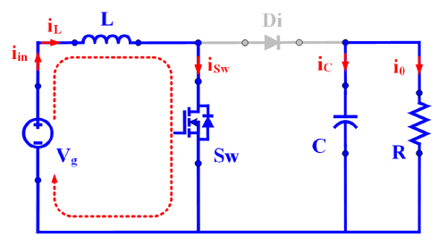
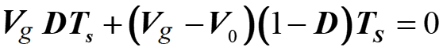
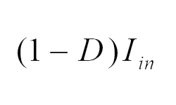

### Theory

The circuit configuration of boost converter is given in Fig. 1

  
  
Fig. 1 Circuit configuration of Boost Converter.

 
Based on the operation of switch (Sw: ON/OFF-state) the operating principle of the converter is explained below briefly. 
  

<table border="0" align="center" style="width:100%; border:none;">
  <tr>
<td style="width:50%">

  
**Mode – I :  Switch (Sw): ON and Diode (Di): OFF**
 

  
Fig. 2(a). Equivalent circuit in mode-I.
  

</td>
<td style="width:50%">
  

  
**Mode – II :  Switch (Sw): OFF and Diode (Di): ON**
 

  
Fig. 2(b). Equivalent circuit in mode-II.
  

 
    </td>
  </tr>
</table>
 

**a) Voltage conversion ratio or voltage gain (M)**

Voltage across inductor L:

**Mode – I :**
 

  

    ..(1)

  

**Mode – II :**
 

  
      

    ..(2)
      
     
  

Applying volt-sec balance on inductor (eqn. 1 and 2)
 

  
      

    ..(3)

  
On simplifying the eqn. 3
 

  
      

    ..(4)
   
      

 

 
  
**b) Average current through inductor (IL):**
 
Current through capacitor

**Mode – I :**

  

  
      

    ..(5)
      

  

 
  
  **Mode – II :**
 

  
      

    ..(6)
      

  

 
Applying charge-sec balance on capacitor (eqn. 5 and 6)
  

  
      

    ..(7)
      

  
On solving eqn. 7
  

  
      

    ..(8)
      

 

 

**c) Power balance under ideal condition (neglecting losses):**
  
From Fig. 1, the source current itself is the inductor current and hence
 

 

  
      

    ..(9)
      

      

  
Simplifying eqns. 8 and 9 gives the current gain
  

  
      

    ..(10)
      
    

   
From eqns. 4 and 10
   

  
      

    ..(11)
      

     
Hence under ideal condition, the power drawn from the source is equal to power supplied to load.

  

  
      

    ..(12)
      

 

 

**d) Inductor current ripple:**     

From eqn. 1,

 

  
      

    ..(13)
      

  

  
Therefore, the inductor ripple current is    

  
      

    ..(14)
      

        

 

 

**e) Current through various components:**

The current through various components are given in Fig. 3.

  
  
Fig. 3. Current through various components.

 

<table align="center" style="width: 100%; >
  <tr style="text-align: center; font-weight: bold;">
    <td style="text-align: center; font-weight: bold;">&nbsp;</td>
    <td style="text-align: center; font-weight: bold;" colspan="2">
      Mode-I (DT)
    </td>
    <td style="text-align: center; font-weight: bold;" colspan="2">
      Mode-II (1-D)T
    </td>
    <td style="text-align: center; font-weight: bold;">Average Current</td>
  </tr>
  <tr>
    <td></td>
    <td>imin</td>
    <td>imax</td>
    <td>imin</td>
    <td>imax</td>
    <td>Iavg</td>
  </tr>
  <tr>
    <td>iL</td>
    <td></td>
    <td></td>
    <td></td>
    <td></td>
    <td></td>
  </tr>
  <tr>
    <td>iC</td>
    <td></td>
    <td></td>
    <td></td>
    <td></td>
    <td>&#48;</td>
  </tr>
  <tr>
    <td>iSw</td>
    <td></td>
    <td></td>
    <td>&#48;</td>
    <td>&#48;</td>
    <td></td>
  </tr>
  <tr>
    <td>iDi</td>
    <td>&#48;</td>
    <td>&#48;</td>
    <td></td>
    <td></td>
    <td></td>
  </tr>
</table>

 

 

**f) Voltage and current stress on various components:**

 
		
<table align="center" style="width: 100%; >
  <tr style="text-align: center; font-weight: bold;">
    <td style="text-align: center; font-weight: bold;">
      Component
    </td>
    <td style="text-align: center; font-weight: bold;">
      Voltage stress
    </td>
    <td style="text-align: center; font-weight: bold;">
      Current Stress
    </td>
  </tr>
  <tr>
    <td>Inductor (L)</td>
    <td></td>
    <td></td>
  </tr>
  <tr>
    <td>Capacitor (C)</td>
    <td><em>V&#48;</em></td>
    <td></td>
  </tr>
  <tr>
    <td>Switch (Sw)</td>
    <td><em>V&#48;</em></td>
    <td></td>
  </tr>
  <tr>
    <td>Diode (Di)</td>
    <td><em>V&#48;</em></td>
    <td></td>
  </tr>
</table>

 

 

**g) Efficiency analysis:**     

 

  
      

    ..(15)
      

  

  
Therefore, the inductor ripple current is    

  
      

    ..(16)
      

 
     
The power loss occurring in various components are given below. 
Power loss in inductor:

 

  
      

    ..(17)
      

  

  
Power loss in capacitor:    

  
      

    ..(18)
      

 

Power loss in switch:

 

  
      

    ..(19)
      

  

  
Power loss in Diode:   

  
      

    ..(20)
      

 
     
Total power loss:

 

  
      

    ..(21)
      

  

 

 

**h) Effect of non-idealities on voltage gain expression:**     

  

  
  
Fig. 4.  Circuit configuration of conventional boost converter with non-idealities.

 
Based on the operation of switch (Sw: ON/OFF-state) the operating principle of the converter is explained below briefly. 
  

**a) Voltage conversion ratio or voltage gain (M)**

Voltage across inductor L

**Mode – I :**
 

  

    ..(1)

  

**Mode – II :**
 

  
      

    ..(2)
      
     
  

Applying volt-sec balance on inductor (eqn. 1 and 2)
 

      
  ==================================  

 
~In the event of battery voltage/load fluctuations, load voltage varies. However, DC-loads require constant voltage for their feasible/efficient operation, which demands automatic control. A simple PI-controller (proportional plus integral controller [2], see Fig. 5(a)) is capable of maintaining a constant load voltage despite the fluctuations (battery voltage/load). Here, the controller adjusts the pulse width of the PWM signal [2] according to the input error signal. As shown in Fig. 5(b), the error signal is the difference between the reference voltage and actual load voltage.~

 

  

