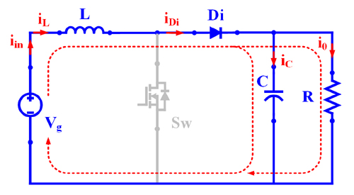

### Theory

  
  
Fig. 1 Circuit diagram of boost converter.

Based on the modes of operation, the voltage gain formulation (in brief) is given below:

| Month    | Savings |

Mode – I :  Switch S:ON-state, Diode: OFF-state
Mode – II :  Switch S:OFF-state , Diode: ON-state

Fig. 1(a). Equivalent circuit in mode-I.
Fig. 1(b). Equivalent circuit in mode-II.

