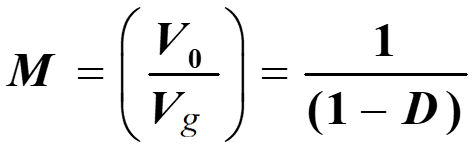
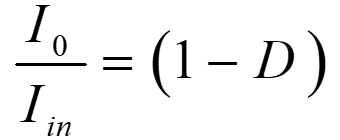

### Theory

  
  
Fig. 1 Circuit diagram of boost converter.

 
Based on the modes of operation, the voltage gain formulation (in brief) is given below:
  

  
**Mode – I :  Switch S:ON-state, Diode: OFF-state**

 

 

Fig. 1(a). Equivalent circuit in mode-I.
  

**Mode – II :  Switch S:OFF-state , Diode: ON-state**
 

 
Fig. 1(b). Equivalent circuit in mode-II.
  

Voltage across inductor L: &nbsp;&nbsp;&nbsp;&nbsp;&nbsp;  &nbsp;&nbsp;&nbsp;&nbsp;&nbsp;&nbsp;&nbsp; 

  
Applying volt-sec balance on inductor: &nbsp;&nbsp;&nbsp;&nbsp;&nbsp; 
  
Simplifying the expression &nbsp;&nbsp;&nbsp;&nbsp;&nbsp; 

  

Fig. 2.  Circuit configuration of boost converter with non-idealities.

Voltage across inductor L: &nbsp;&nbsp;&nbsp;&nbsp;&nbsp;  &nbsp;&nbsp;&nbsp;&nbsp;&nbsp;&nbsp;&nbsp; 

Applying volt-sec balance on inductor: &nbsp;&nbsp;&nbsp;&nbsp;&nbsp; 

Simplifying the expression &nbsp;&nbsp;&nbsp;&nbsp;&nbsp; 

In the event of battery voltage/load fluctuations, load voltage varies. However, DC-loads require constant voltage for their feasible/efficient operation, which demands automatic control. A simple PI-controller (proportional plus integral controller [2], see Fig. 4(a)) is capable of maintaining a constant load voltage despite  the fluctuations (battery voltage/load). Here, the controller adjusts the pulse width of the PWM signal [2] according to the input error signal. As shown in Fig. 4(b), the error signal is the difference between the reference voltage and actual load voltage.

  

Fig. 3.  Block Diagram of closed-loop control.

   

Fig. 3.  Block Diagram of closed-loop control.
  

