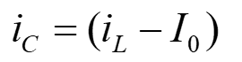
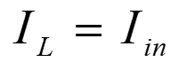
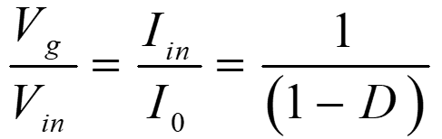

### Theory

The circuit configuration of boost converter is given in Fig. 1.

  
  
Fig. 1 Circuit Diagram of Boost Converter.

 
Based on the modes of operation, the voltage gain formulation (in brief) is given below:
  

<table border="0" align="center" style="width:100%; border:none;">
  <tr>
<td style="width:50%">

  
**Mode – I :  Switch S:ON-state, Diode: OFF-state**
 

  
Fig. 2(a). Equivalent circuit in mode-I.
  

</td>
<td style="width:50%">
  

  
**Mode – II :  Switch S:OFF-state, Diode: ON-state**
 

  
Fig. 2(b). Equivalent circuit in mode-II.
  

 
    </td>
  </tr>
</table>
 

**a) Voltage conversion ratio or voltage gain (M)**

Voltage across inductor L:

**Mode – I :**
 

  
      

    ..(1)
      

  

**Mode – II :**
 

  
      

    ..(2)
      
     
  

Applying volt-sec balance on inductor (eqn. 1 and 2)
 

  
      

    ..(3)

  
On simplifying the eqn. 3
 

  
      

    ..(4)
   
      

 

 
  
**b) Effect of non-idealities on voltage gain expression:**

  

 
Fig. 3.  Circuit configuration of conventional boost converter with non-idealities.
 

Voltage across inductor L:

**Mode – I :**
 

  
      

    ..(5)
      

  

**Mode – II :**
 

  
      

    ..(6)
      

        

Applying volt-sec balance on inductor (eqn. 5 and 6)
 

  
      

    ..(7)
      

  

On solving eqn. 7
 

  
      

    ..(8)
      

 

 
  
**c) Voltage Regulation and Closed-loop Control:**

 
In the event of battery voltage/load fluctuations, load voltage varies. However, DC-loads require constant voltage for their feasible/efficient operation, which demands automatic control. A simple PI-controller (proportional plus integral controller [2], see Fig. 5(a)) is capable of maintaining a constant load voltage despite the fluctuations (battery voltage/load). Here, the controller adjusts the pulse width of the PWM signal [2] according to the input error signal. As shown in Fig. 5(b), the error signal is the difference between the reference voltage and actual load voltage.

 

  

